**NOTE on Bao_cao_review_GitHub: Trần Minh Anh phụ trách tiêu chí số 8, 9**
# Kết quả thực hành API Session 03

## Lab 1 — Blog API

### GET `/posts`

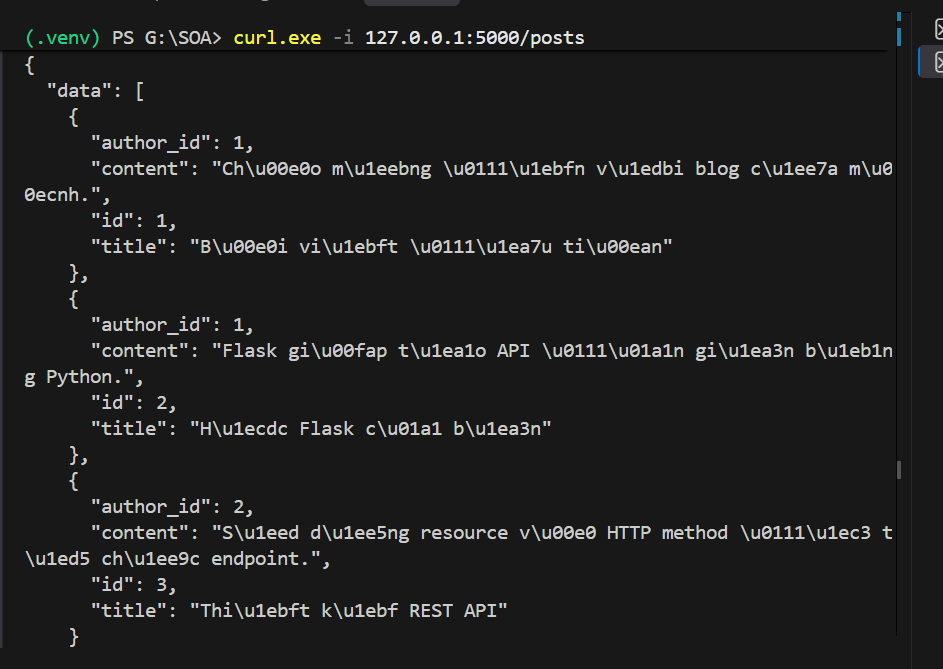

*Kết quả chạy `GET /posts`: server trả về danh sách các bài viết hiện có.*

### POST `/posts`

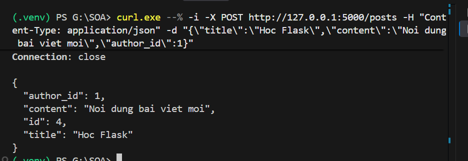

*Kết quả chạy `POST /posts`: server tạo bài viết mới với `id = 4` và trả về dữ liệu vừa tạo.*

## Lab 2 — Problem Details và xử lý lỗi

### Lỗi ID không hợp lệ

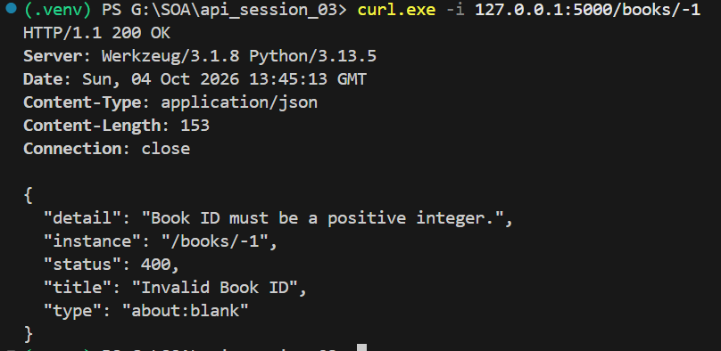

*Kết quả gọi `/books/-1`: response mô tả lỗi `400` vì Book ID phải là số nguyên dương.*

### Lỗi HTTP 404

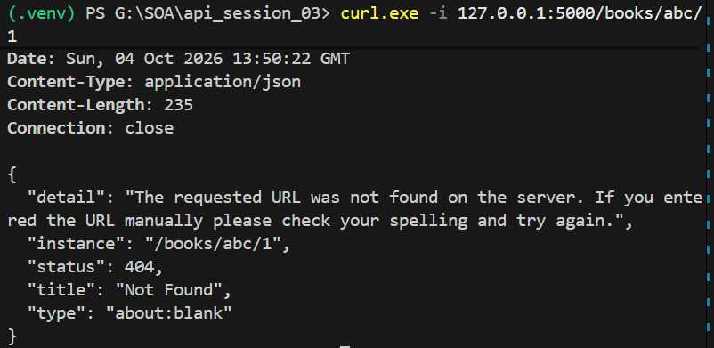

*Kết quả gọi một URL không khớp route: server trả nội dung Problem Details cho lỗi `404 Not Found`.*

### Lỗi ngoài dự kiến

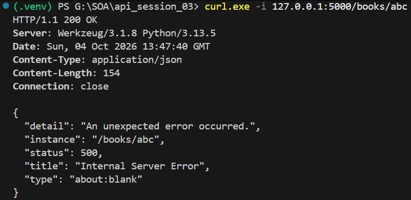

*Kết quả khi phát sinh lỗi chưa được xử lý trong route: server trả nội dung Problem Details cho lỗi `500 Internal Server Error`.*

## Lab 3 — Cursor pagination cho `/orders`

### Lấy trang đầu tiên

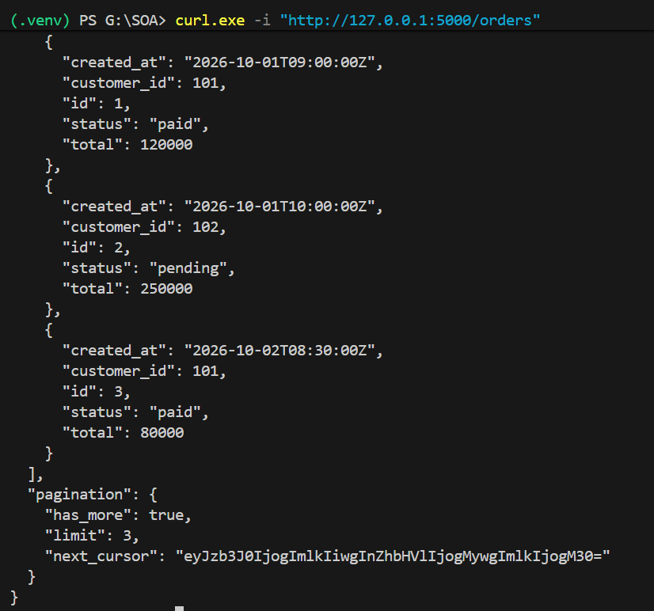

*Kết quả chạy `GET /orders`: server trả 3 order đầu tiên cùng `has_more` và `next_cursor`.*

### Lọc theo trạng thái

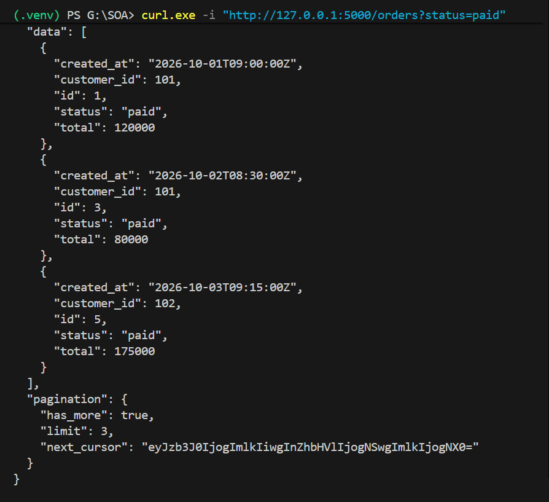

*Kết quả chạy `/orders?status=paid`: chỉ các order có trạng thái `paid` được trả về.*

### Sắp xếp theo thời gian tạo

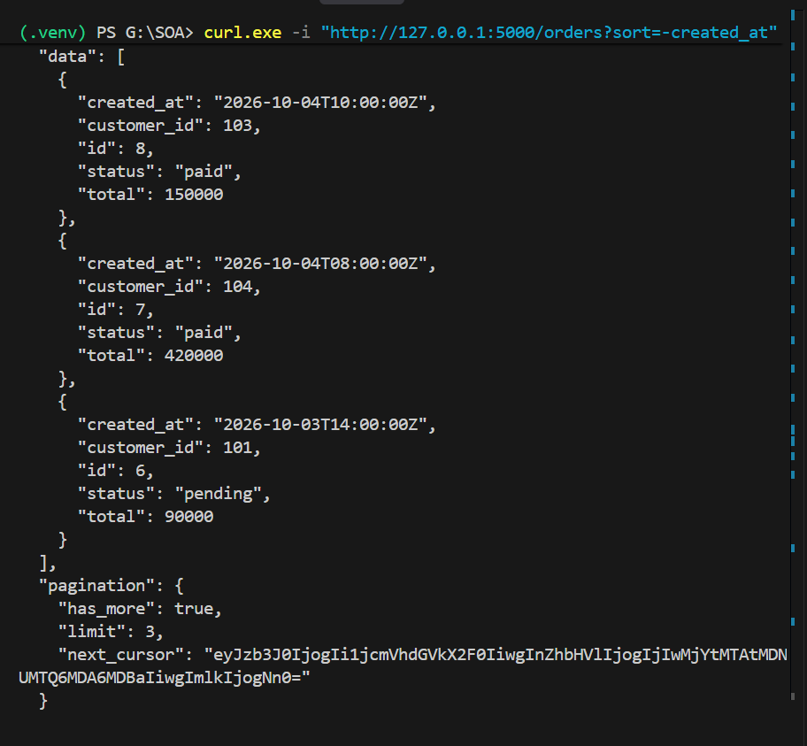

*Kết quả chạy `/orders?sort=-created_at`: các order được sắp xếp từ mới nhất đến cũ nhất.*

### Sparse fieldsets

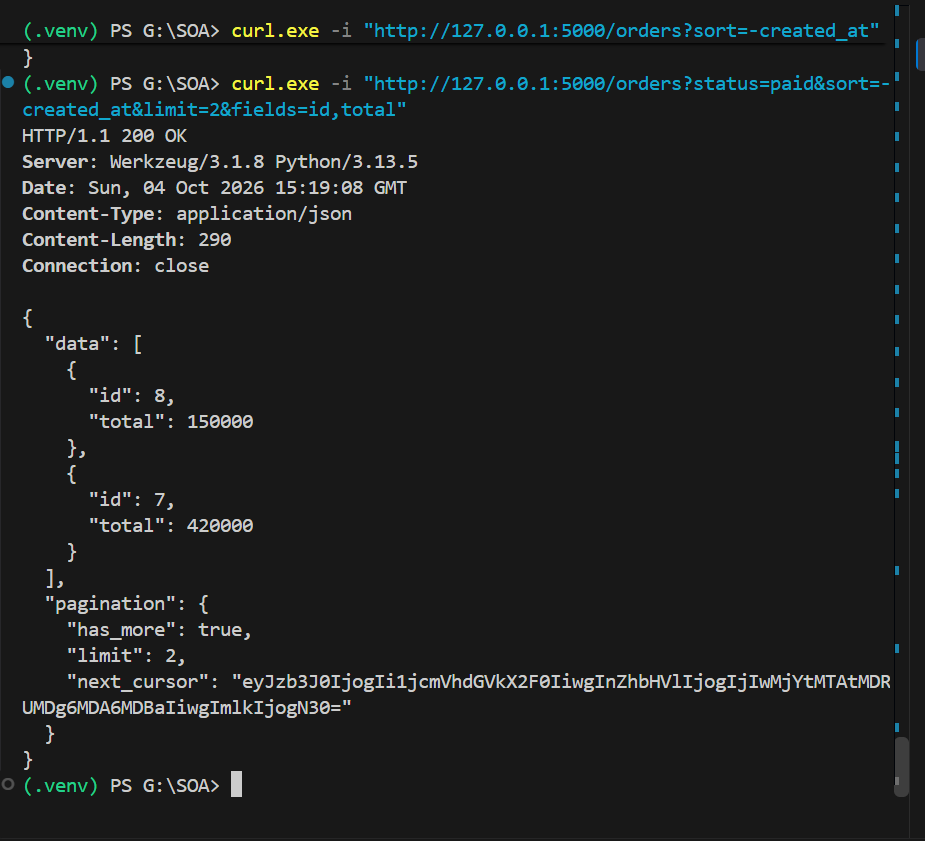

*Kết quả kết hợp filter, sort, limit và `fields=id,total`: mỗi order chỉ trả về hai field được yêu cầu.*

### Lấy trang tiếp theo bằng cursor

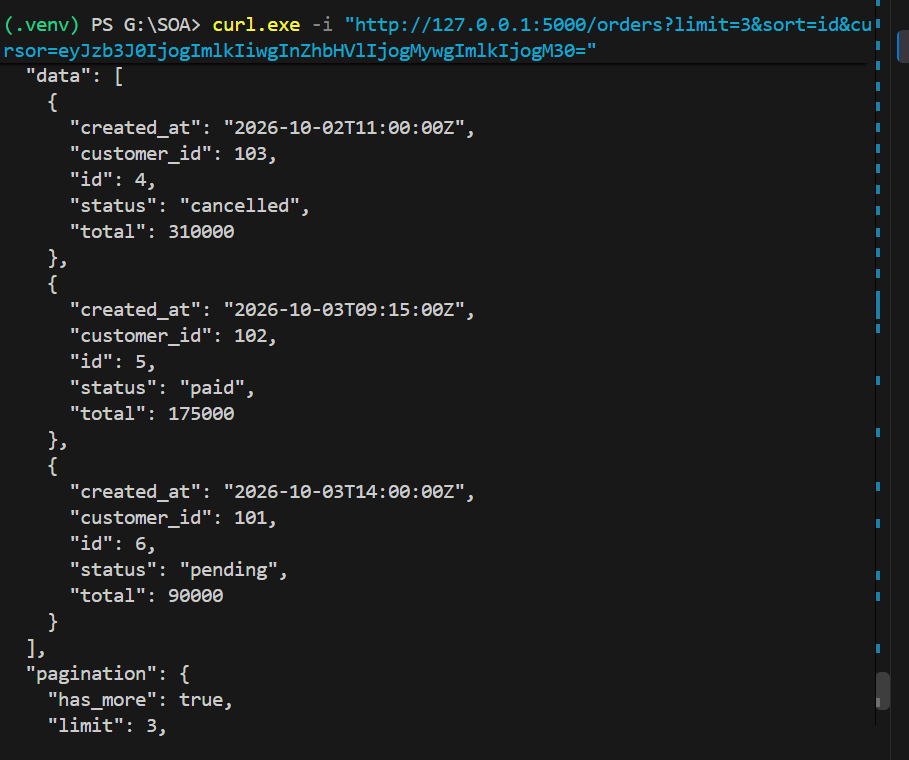

*Kết quả gửi lại `next_cursor`: server tiếp tục trả các order sau vị trí cuối của trang trước.*

### Cursor không khớp với sort

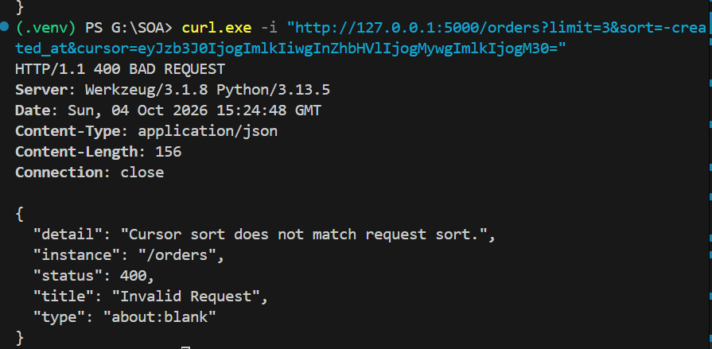

*Kết quả dùng cursor của `sort=id` với `sort=-created_at`: server từ chối request và trả lỗi `400 Bad Request`.*
